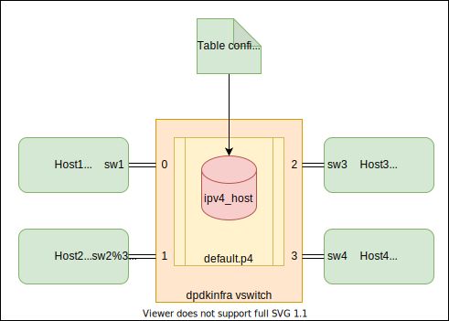

<!--
/*
 * SPDX-FileCopyrightText: Copyright 2021-present Sander Tolsma. All rights reserved
 * SPDX-License-Identifier: Apache-2.0
 */
- -->

# Go-P4Pack: Generic packages & examples for Go & P4 based networking applications
[](https://opensource.org/licenses/Apache-2.0)
[](https://creativecommons.org/licenses/by-nc/4.0/)
[](https://coveralls.io/github/stolsma/go-p4pack?branch=main)
[](https://github.com/stolsma/go-p4pack/actions/workflows/go-build-lint-test.yml)

Always wanted to write performant P4 langage based networking applications in Go but don't know where to start? Then this is the place to get to. This repository contains several ready to use packages written in Go along with several example applications using those packages. The DPDK (DataPlane Development Kit) library is being used to get a operational performant dataplane.

One of the larger (currently not ready) example applications is a p4Runtime/gNMI/gNOI API capable, Golang + DPDK SWX based, P4 programmable virtual (soft) switch. But also a gNMI CLI application and a bare bones DPDK SWX based dataplane switch (cmd/dpdkinfra) is included.

The figure below shows the go packages (and high level relation between them) available in this repository. For more information go to the [documentation](./doc/README.md) pages.

Use the quick start steps below and start experimenting with the ready to use container image!

[](./doc/drawings/design.drawio.svg)

# Installation, build & run go-p4pack (docker) container

## Introduction

All example programs and supporting compiled libraries (DPDK and others) are included in the go-p4pack container image. Each night a 'latest' image is automatically created by GitHub CI and uploaded to the GitHub Container Registry (GHCR). Also the images for the stable go-p4pack releases can be downloaded from GHCR.
In the next paragraphs it will be explained how you can use this standard image and how you can build your own local image if you want to.

Prerequisites:
- The user needs sudo execution permission on the host system


## Download repository and build container yourself

``` bash
git clone https://github.com/stolsma/go-p4pack.git
cd go-p4pack
```

Build go-p4pack docker image with all the example applications:

``` bash
./build/dpdk/build.sh 
./build/go-p4pack/build.sh 
```

## Use pre build container from GHCR

If you did not want to do the local build, then pull the image from the GitHub Container Registry (ghcr.io):

``` bash
docker pull ghcr.io/stolsma/go-p4pack:latest
```

## Before startup: setup hugepages

Before you can run the example applications included in the go-p4pack docker image you first need to setup hugepages on your system.

``` bash
sudo mkdir /mnt/huge
sudo mount -t hugetlbfs nodev /mnt/huge
sudo sysctl -w vm.nr_hugepages=256
```

## Start go-p4pack docker container

Run go-p4pack docker image:

TODO: extend go-p4pack script for easy build & startup of the docker image

``` bash
./go-p4pack.sh
```

## Startup of the DPDK SWX Pipeline driver (cmd/dpdkinfra)

TODO: Describe how the different compiled example programs can be run!

The standard dpdkinfra example program can be run by:

``` bash
root@dec72f3353eb:/go-p4pack# ./dpdkinfra 
```

## Connect to the cmd/dpdkinfra driver integrated ssh terminal

From a second bash terminal (connected to the docker host) start a ssh session:

``` bash
ssh -p 2222 user@0.0.0.0
```

And play with the shell cli!

## Test the Go DPDK SWX Pipeline driver (cmd/dpdkinfra)

Connect to the runing docker image with:

``` bash
docker exec -it go-p4pack /bin/bash
```

When not given a `-c [filename]` option, dpdkinfra will automatically load and use the configuration file included in `./examples/default/config.json`. That configuration file creates two tap interfaces and two virtio-kernel interfaces (called sw1...sw4) connected to port 0...3 of the example switch.
Also a standard simple switched-router p4 program is loaded in the pipeline and the IPv4 address table (`ipv4_host`) of that pipeline is loaded with the following values:

``` text
match 0xc0a8de01 action send port 0
match 0xc0a8de02 action send port 1
match 0xc0a8de03 action send port 2
match 0xc0a8de04 action send port 3
```

Where `0xc0a8de01` is hexidecimal notation for `192.168.222.1`  

Setup a network namespaced test environment with four hosts using the 4 created interfaces:

``` bash
./examples/default/createenv.sh
```

This script will create 4 network namespaces (called `host1...host4`), each with an interface included connected to the example switch. `Host1` has interface `sw1`, with MAC address `32:fb:fa:c6:67:01` & IPv4 `192.168.222.1/24`. Also the netns host ARP table will be loaded with references to the other hosts. See table below for all the used attributes.

| Host  | Interface    | Switch Port | MAC Address       | IPv4 address     |
|-------|--------------|-------------|-------------------|------------------|
| host1 | sw1 (tap)    | 0           | 32:fb:fa:c6:67:01 | 192.168.222.1/24 |
| host2 | sw2 (tap)    | 1           | 32:fb:fa:c6:67:02 | 192.168.222.2/24 |
| host3 | sw3 (virtio) | 2           | 32:fb:fa:c6:67:03 | 192.168.222.3/24 |
| host4 | sw4 (virtio) | 3           | 32:fb:fa:c6:67:04 | 192.168.222.4/24 |

Created example network:

[](./doc/drawings/example-network.drawio.svg)

To test connectivity between the host namespaces you can use the following commands:

``` bash
sudo ip netns list
sudo ip netns exec host1 ping 192.168.222.2
sudo ip netns exec host2 ping 192.168.222.1
sudo ip netns exec host3 ping 192.168.222.1
sudo ip netns exec host4 ping 192.168.222.1
```

Do some performance testing with `iperf`

``` bash
# add -u to do UDP testing!
sudo ip netns exec host1 iperf -s
sudo ip netns exec host2 iperf -c 192.168.222.1 -P 10

sudo ip netns exec host3 iperf -s
sudo ip netns exec host4 iperf -c 192.168.222.3 -P 10

# with iperf3...
sudo ip netns exec host1 iperf3 -s
sudo ip netns exec host2 iperf3 -c 192.168.222.1 -P 10

# to dump packets send and received from an interface
sudo ip netns exec host1 tcpdump -e -i sw1
```

To remove the test namespace environment use:

``` bash
sudo ip netns del host1
sudo ip netns del host2
sudo ip netns del host3
sudo ip netns del host4
```
